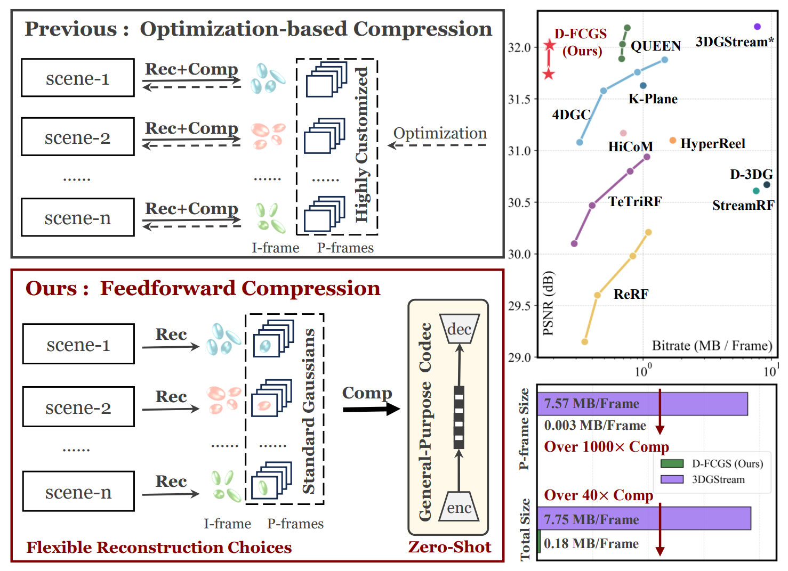
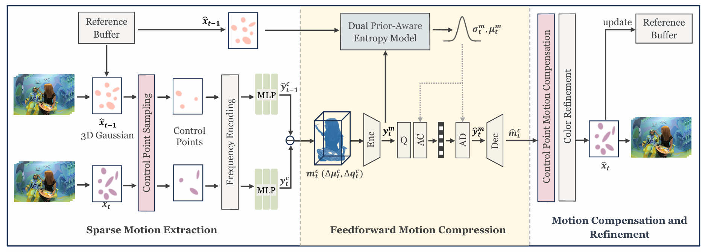

# [ARXIV'25] D-FCGS
Official Pytorch Implementation of **D-FCGS: Feedforward Compression of Dynamic Gaussian Splatting for Free-Viewpoint Videos**.

[Wenkang Zhang](https://mr-zwkid.github.io/), 
[Yan Zhao](https://github.com/adminasmi), 
[Qiang Wang](https://scholar.google.com/citations?user=17E9fdUAAAAJ&hl=en), 
[Zhengxue Cheng](https://medialab.sjtu.edu.cn/author/zhengxue-cheng/)

<!-- [[`Arxiv`](https://arxiv.org/pdf/2410.08017)] [[`Project`](https://yihangchen-ee.github.io/project_fcgs/)] [[`Github`](https://github.com/YihangChen-ee/FCGS)] -->


## Overview
<p align="left">

</p>

Left: Existing GS-based methods for FVV often couple scene reconstruction with compression and requireper scene optimization, resulting in reduced generalizability. In contrast,our D-FCGS decouples these stages with a single feedforward
 pass that compresses inter-frame motion in Gaussian frames,enabling efficient compression and storage for FFV. Right: Despite
 being optimization-free, D-FCGS achieves competitive rate-distortion performance compared to optimization-based methods.

## Method
<p align="left">

</p>


## Installation

1. clone our code
   ```bash
   git clone https://github.com/Mr-Zwkid/FCGS-D.git --recursive  
   ```

2. create conda env and enter it
   ```bash
   conda create -n dfcgs python=3.10
   conda activate dfcgs
   ```

3. install pakages
   ```bash
   conda install -c "nvidia/label/cuda-11.8.0" cuda-toolkit
   pip install torch==2.1.2+cu118 torchvision==0.16.2+cu118 --extra-index-url https://download.pytorch.org/whl/cu118
   pip install pytorch3d lpips tqdm plyfile commentjson
   pip install git+https://github.com/NVlabs/tiny-cuda-nn/#subdirectory=bindings/torch
   pip install submodules/simple-knn
   pip install submodules/diff-gaussian-rasterization
   pip install submodules/arithmetic
   ```
   
## Dataset Preprocess
1. Multiview Video Datasets
   - [Neural 3D Video](https://github.com/facebookresearch/Neural_3D_Video/releases/tag/v1.0)
   - [Meetroom](https://www.modelscope.cn/datasets/DAMOXR/dynamic_nerf_meeting_room_dataset/files)
   - [Google Immersive](https://github.com/augmentedperception/deepview_video_dataset?tab=readme-ov-file)
   - [WideRange4D](https://huggingface.co/datasets/Gen-Verse/WideRange4D)

2. Extract Frames and Colmap Process
   Assume the path to multi-view videos of one scene is `data_video/Immersive/04_Truck`, use following command to derive frames and per-frame colmap results.
   ```bash
   python data_preprocess.py --base_dir data_video/Immersive/04_Truck --start_frame 0 --end_frame 149 [--scale_factor 2]
   # frame range: [start_frame, end_frame]
   ```

3. Derive Inititial Gaussian Frame
   ```bash
   python derive_init_gs.py --dataset_dir ./data_video/Immersive --scene_list 04_Truck
   ```

4. Derive Subsequent Gaussian Frames
   ```bash
   python derive_gs_frames.py --dataset_dir ../data_video/Immersive --scene_list 04_Truck --start_frame 1 --end_frame 149
   # frame range: [start_frame, end_frame]
   ```

5. The dataset of one scene `data_video/Immersive/04_Truck` ends like:

   ```
   04_Truck/
   ├── camera_0001.mp4 ... camera_0046.mp4   # Original multi-view videos
   ├── cfg_args.json  # for 3DGStream train_frames.py
   ├── models.json   # camera parameters
   ├── distorted/
   │   ├── database.db
   │   └── sparse/
   │       └── 0/
   │           ├── cameras.bin
   │           ├── frames.bin
   │           ├── images.bin
   │           ├── points3D.bin
   │           ├── project.ini
   │           └── rigs.bin
   ├── frame000000/
   │   ├── images/
   │   │   ├── cam01.png ... cam46.png      # All camera images at this frame (undistorted version)
   │   ├── gs/
   │   │   ├── cameras.json
   │   │   ├── input.ply
   │   │   ├── per_view.json
   │   │   ├── point_cloud/
   │   │   │   └── iteration_3000/
   │   │   │       └── point_cloud.ply
   │   │   ├── results.json
   │   │   └── ... (other configs/results)
   │   ├── sparse/
   │   │   └── 0/
   │   ├── distorted/
   │   ├── run-colmap-geometric.sh
   │   ├── run-colmap-photometric.sh
   │   ├── stereo/
   │   └── ... (other Colmap related folders)
   ├── frame000001/
   │   ├── images/
   │   │   ├── cam01.png ... cam46.png      # All camera images at this frame (undistorted version)
   │   ├── gs/
   │   │   ├── 0_rendering1.png
   │   │   ├── 0_rendering2.png
   │   │   ├── NTC.pth
   │   │   ├── cfg_args
   │   │   ├── point_cloud/
   │   │   │   ├── iteration_150/
   │   │   │   │   └── point_cloud.ply
   │   │   │   └── iteration_250/
   │   │   │       └── point_cloud.ply
   │   │   └── results.json
   │   ├── sparse/
   │   │   └── 0/
   │   ├── stereo/
   │   └── ...
   ├── frame000002/
   └── ...
   ```

- `camera_XXXX.mp4`: Original videos for each camera (You can delete them)
- `frame000000/`, `frame000001/`, ...: Per-frame folders, each containing all camera images and reconstruction results for that frame.
  - `images/`: All camera images for this frame (undistorted), named as `camXX.png`.
  - `gs/`: Gaussian point cloud and related configs/results.
  - `sparse/`: Colmap sparse reconstruction results.
  - Other folders: Colmap intermediate files, distorted images, etc.
   

## Run


## Contact

- Wenkang Zhang: conquer.wkzhang@sjtu.edu.cn

## Citation

<!-- ```bibtex
@article{fcgs2024,
  title={Fast Feedforward 3D Gaussian Splatting Compression},
  author={Chen, Yihang and Wu, Qianyi and Li, Mengyao and Lin, Weiyao and Harandi, Mehrtash and Cai, Jianfei},
  journal={arXiv preprint arXiv:2410.08017},
  year={2024}
}
``` -->


## Acknowledgement

 - We thank authors from [3D-GS](https://github.com/graphdeco-inria/gaussian-splatting) for presenting such an excellent work.
 - We thank authors from [3DGStream](https://github.com/SJoJoK/3DGStream) for extending 3DGS to a streamable version, thus providing a simple way of generating sequential Gaussian frames.
 - We thank authors from [FCGS](https://github.com/YihangChen-ee/FCGS) for their pioneering work on feedforward compression of static Gaussian Splatting.